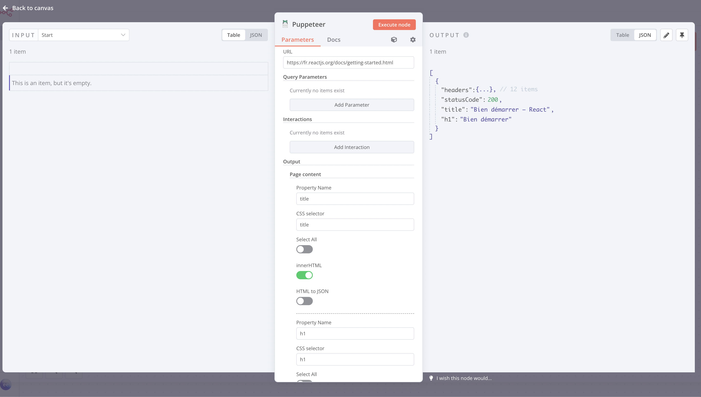

# n8n-nodes-puppeteer-extended

[n8n](https://www.n8n.io) node based on [n8n-nodes-puppeteer](https://github.com/drudge/n8n-nodes-puppeteer) for requesting webpages using [Puppeteer](https://pptr.dev/), a Node library which provides a high-level API to control Chrome or Chromium over the [DevTools Protocol](https://chromedevtools.github.io/devtools-protocol/).

This version brings features allowing more complex interactions with web pages:

- Click on elements
- Fill in fields
- Fetch content or take a screenshot of a specific area (via CSS selectors)
- Convert HTML to JSON (and turn any page into an API)
- Configure the viewport
- Set additional conditions to validate the loading of a page (ex: wait for selector)
- Inject HTML/CSS/JS
- Allow sequences of actions by combining nodes on a single execution while you keep the same session (navigate on multiple pages, take several screenshots...)
- Allow multiple output combination on a single node
- Granular management of options (globally and on each sequence)

## How to install

### Community Nodes (Recommended)

For users on n8n v0.187+, your instance owner can install this node from [Community Nodes](https://docs.n8n.io/integrations/community-nodes/installation/).

1. Go to **Settings > Community Nodes**.
2. Select **Install**.
3. Enter `n8n-nodes-puppeteer-extended` in **Enter npm package name**.
4. Agree to the [risks](https://docs.n8n.io/integrations/community-nodes/risks/) of using community nodes: select **I understand the risks of installing unverified code from a public source**.
5. Select **Install**.

After installing the node, you can use it like any other node. n8n displays the node in search results in the **Nodes** panel.

### Manual installation

To get started install the package in your n8n root directory:

`npm install n8n-nodes-puppeteer-extended`

For Docker-based deployments, you'll need to make sure [puppeteer is installed](https://developer.chrome.com/docs/puppeteer/troubleshooting/#running-puppeteer-in-docker) first. Then, add the following line before the font installation command in your [n8n Dockerfile](https://github.com/n8n-io/n8n/blob/master/docker/images/n8n/Dockerfile):

`RUN cd /usr/local/lib/node_modules/n8n && npm install n8n-nodes-puppeteer-extended`

Check out [this gist](https://gist.github.com/hckdotng/4232ceaaab6a3533aaca022cc2fdd726) for a working example with docker-compose.

>
> **Note:** If you've having issues running puppeteer, please check their [Troubleshooting guide](https://github.com/puppeteer/puppeteer/blob/main/docs/troubleshooting.md) before opening an issue here.
>

## Node Reference

* **Global options**
    * **Emulate Device**: Allows you to specify a [device](https://github.com/puppeteer/puppeteer/blob/main/src/common/DeviceDescriptors.ts) to emulate when requesting the page.
    * **Extra Headers**: Allows you add additional headers when requesting the page.
    * **Launch Arguments**: Allows you to specify additional command line arguments passed to the browser instance.
    * **Viewport**: Allows you to specify a window size in pixels (Width and Height)
    * **Timeout**: Allows you to specify tge maximum navigation time in milliseconds. You can pass 0 to disable the timeout entirely.
    * **Wait Until**: Allows you to change how Puppeteer considers navigation completed.
        * `load`: The load event is fired.
        * `networkidle0`: No more than 0 connections for at least 500 ms.
        * `networkidle2`: No more than 2 connections for at least 500 ms.
    * **Time to Wait**: Allows you specify a time (ms) for Puppeteer to wait before any interactions and content output.
    * **Wait for Selector**: Allows you specify Puppeteer to wait for a selector to appear in page before any interactions and content output.
    * **Page Caching**: Allows you to toggle whether pages should be cached when requesting.
    * **Headless mode**: Allows you to change whether to run browser runs in headless mode or not.
    * **Stealth mode**: When enabled, applies various techniques to make detection of headless Puppeteer harder. Powered by [puppeteer-extra-plugin-stealth](https://github.com/berstend/puppeteer-extra/tree/master/packages/puppeteer-extra-plugin-stealth).
    * **Proxy Server**: Allows Puppeteer to use a custom proxy configuration. You can specify a custom proxy configuration in three ways:
        By providing a semi-colon-separated mapping of list scheme to url/port pairs.
        For example, you can specify:

            http=foopy:80;ftp=foopy2

        to use HTTP proxy "foopy:80" for http URLs and HTTP proxy "foopy2:80" for ftp URLs.

        By providing a single uri with optional port to use for all URLs.
        For example:

            foopy:8080

        will use the proxy at foopy:8080 for all traffic.

        By using the special "direct://" value.

            direct://" will cause all connections to not use a proxy.
    * **Inject HTML**: Allows you to append HTML to the body.
    * **Inject CSS**: Allows you to append raw CSS to the head.
    * **Inject JS**: Allows you to append raw JS to the head.
* **Node options**: These options override any corresponding global options for the step
    * **Timeout**: Allows you to specify tge maximum navigation time in milliseconds. You can pass 0 to disable the timeout entirely.
    * **Wait Until**: Allows you to change how Puppeteer considers navigation completed.
        * `load`: The load event is fired.
        * `networkidle0`: No more than 0 connections for at least 500 ms.
        * `networkidle2`: No more than 2 connections for at least 500 ms.
    * **Time to Wait**: Allows you specify a time (ms) for Puppeteer to wait before any interactions and content output.
    * **Wait for Selector**: Allows you specify Puppeteer to wait for a selector to appear in page before any interactions and content output.
    * **Inject HTML**: Allows you to append HTML to the body.
    * **Inject CSS**: Allows you to append raw CSS to the head.
    * **Inject JS**: Allows you to append raw JS to the head.
* **URL**: URL to the requesting page. Required on the first node but if it's empty in a following node, Puppeteer will stay on the same page. It can be useful to achieve complex operations.
* **Query Parameters**: The query parameter to send.
* **Interactions**: Allows you to click on elements or fill fields, in order Puppeteer will wait for the element to display (timeout 10s) so you can easily chain multiple interactions even if there is asynchonous call.
    * **Selector**: CSS selector to specify the element to interact with.
    * **Value**: If specified, Puppeteer will try to type the value with the keyboard emulation, if not, Puppeteer will click on the element.
    * **Wait for navigation**: Set it to true only if the click triggers a page change, so Puppeteer will wait before any other action.
* **Output**: Output is optional, but if you decide to output data in the current step, you can't select multiple data output even if the UI of n8n allows it. If you need multiple output just add another step without URL to stay on the same page.
    * **Page content**: Returns raw HTML (string) or JSON depending on the options selected and the context.
      * **Property name**: Name of the property returned for this output.
      * **CSS selector**: If empty it will returns the whole page (document), if not the specified element.
      * **Select All**: Instead of grabbing the first element matching the CSS selector, all matching elements will be returned.
      * **innerHTML**: In case of CSS selector (and HTML to JSON set to false), it will returns the raw innerHTML instead of the outerHTML.
      * **HTML to JSON**: Try to convert HTML nodes to JSON with the following logic:
            
            <a href="/contact" class="mr-2 text-sm">Contact</a>

            "a": {
                "@href": "/contact",
                "@class": [
                    "mr-2",
                    "text-sm"
                ],
                "#text": "Contact"
            }

            

                

                    
Hello

                    
Wo<b>r</b>ld!

                

            

            "div": {
                "div": {
                    "@class": "bg-red-500",
                    "p": [
                        "Hello",
                        {
                            "@class": "text-xl",
                            "#text": [
                                "Wo",
                                "ld!"
                            ],
                            "b": "r"
                        }
                    ]
                }
            }

      * **No attributes**: Ignore HTML attributes while converting to JSON.

    * **Screenshot**: Returns binary.
        * **CSS selector**: If empty it captures the whole window or page depending on the options, if not it captures the corresponding zone.
        * **Property Name**: Name of the binary property returned.
        * **Type**: Image type to use between JPG, PNG and WebP.
        * **Quality**: The quality of the image, between 0-100. Not applicable to PNG.
        * **Full Page**: Allows you to capture a screen of the full scrollable content.
    * **PDF**: Returns binary.
        * **Property Name**: Name of the binary property returned.
        * **Page Ranges**: Allows you to specify paper ranges to print, e.g. 1-5, 8, 11-13.
        * **Scale**: Allows you to scale the rendering of the web page. Amount must be between 0.1 and 2
        * **Prefer CSS Page Size**: Give any CSS @page size declared in the page priority over what is declared in the width or height or format option.
        * **Format**: Allows you to specify the paper format types when printing a PDF. eg: Letter, A4.
        * **Height**: Allows you to set the height of paper. You can pass in a number or a string with a unit.
        * **Width**: Allows you to set the width of paper. You can pass in a number or a string with a unit.
        * **Landscape**: Allows you to control whether to show the header and footer
        * **Margin**: Allows you to specify top, left, right, and bottom margin.
        * **Display Header/Footer**: Allows you to specify whether to show the header and footer.
        * **Header Template**: Allows you to specify the HTML template for the print header. Should be valid HTML with the following classes used to inject values into them:
            - `date`: Formatted print date
            - `title`: Document title
            - `url`: Document location
            - `pageNumber` Current page number
            - `totalPages` Total pages in the document
         * **Footer Template**: Allows you to specify the HTML template for the print footer. Should be valid HTML with the following classes used to inject values into them:
            - `date`: Formatted print date
            - `title`: Document title
            - `url`: Document location
            - `pageNumber` Current page number
            - `totalPages` Total pages in the document
        * **Transparent Background**: Allows you to hide the default white background and allows generate PDFs with transparency.
        * **Background Graphic**: Allows you to include background graphics.

## Screenshot

## License

MIT License

Copyright (c) 2022 Nicholas Penree <nick@penree.com>

Permission is hereby granted, free of charge, to any person obtaining a copy
of this software and associated documentation files (the "Software"), to deal
in the Software without restriction, including without limitation the rights
to use, copy, modify, merge, publish, distribute, sublicense, and/or sell
copies of the Software, and to permit persons to whom the Software is
furnished to do so, subject to the following conditions:

The above copyright notice and this permission notice shall be included in all
copies or substantial portions of the Software.

THE SOFTWARE IS PROVIDED "AS IS", WITHOUT WARRANTY OF ANY KIND, EXPRESS OR
IMPLIED, INCLUDING BUT NOT LIMITED TO THE WARRANTIES OF MERCHANTABILITY,
FITNESS FOR A PARTICULAR PURPOSE AND NONINFRINGEMENT. IN NO EVENT SHALL THE
AUTHORS OR COPYRIGHT HOLDERS BE LIABLE FOR ANY CLAIM, DAMAGES OR OTHER
LIABILITY, WHETHER IN AN ACTION OF CONTRACT, TORT OR OTHERWISE, ARISING FROM,
OUT OF OR IN CONNECTION WITH THE SOFTWARE OR THE USE OR OTHER DEALINGS IN THE
SOFTWARE.
